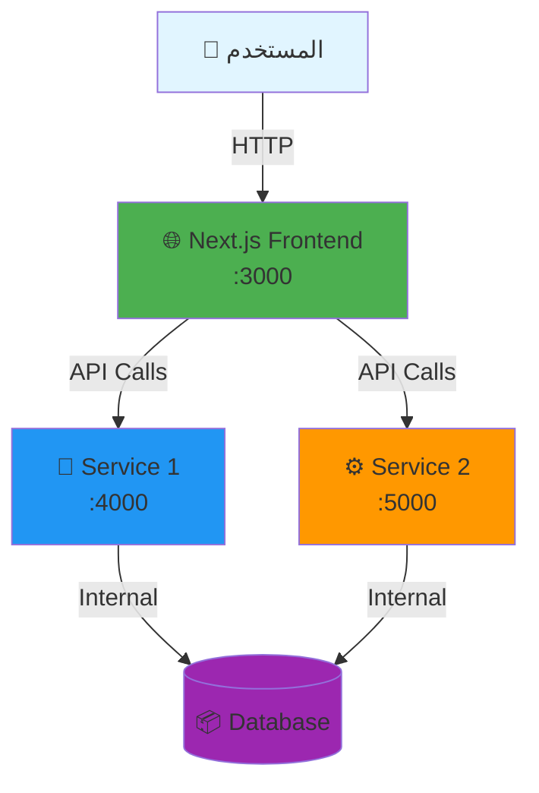

# 🚀 My Next.js Microservices Project

<div align="center">


**بنية تحتية حديثة ومتطورة تعتمد على Microservices باستخدام Next.js وDocker**

[المميزات](#-المميزات-key-features) •
[التثبيت](#️-التثبيت-السريع-installation) •
[الهيكلية](#️-هيكلية-المشروع-architecture) •
[الاستخدام](#-طريقة-الاستخدام-usage)

</div>

---

## 📸 نظرة عامة (Overview)

<div align="center">



</div>

---

## ✨ المميزات (Key Features)

<table>
<tr>
<td width="50%">

### 🎯 البنية التحتية
- ✅ معمارية **Microservices** حديثة
- ✅ فصل كامل بين الخدمات
- ✅ **Monorepo** سهل الإدارة
- ✅ **Docker Compose** للتشغيل بضغطة واحدة

</td>
<td width="50%">

### ⚡ الأداء والتطوير
- ✅ **Hot Reload** تلقائي
- ✅ **TypeScript** للأمان البرمجي
- ✅ **REST API** سريع وفعال
- ✅ جاهز للنشر على **Production**

</td>
</tr>
</table>

---

## 🏗️ هيكلية المشروع (Architecture)

```
📦 my-nextjs-microservices/
├── 🎨 app/                    # Next.js Frontend
│   ├── pages/
│   ├── components/
│   ├── styles/
│   ├── Dockerfile
│   └── package.json
│
├── 🔧 service-1/              # Microservice #1
│   ├── src/
│   ├── Dockerfile
│   └── package.json
│
├── ⚙️ service-2/              # Microservice #2
│   ├── src/
│   ├── Dockerfile
│   └── package.json
│
├── 🐳 docker-compose.yml      # تنسيق الحاويات
└── 📖 README.md               # أنت هنا!
```

---

## 🛠️ التقنيات المستخدمة (Tech Stack)

<div align="center">

| الخدمة | التقنية | المنفذ | الوظيفة |
|:---:|:---:|:---:|:---|
| 🌐 **Frontend** | Next.js 14+ | `3000` | واجهة المستخدم (App Router) |
| 🔧 **Service 1** | Node.js + Express | `4000` | معالجة البيانات والـ API |
| ⚙️ **Service 2** | Node.js + Express | `5000` | معالجة المهام الخلفية |
| 🐳 **Container** | Docker Compose | - | عزل وإدارة الخدمات |
| 🔗 **Communication** | REST API | - | الربط بين الخدمات |

</div>

---

## ⚡️ التثبيت السريع (Installation)

### المتطلبات الأساسية

```bash
# تأكد من تثبيت:
✅ Docker Desktop (أو Docker Engine)
✅ Docker Compose 2.0+
✅ Git
```

### خطوات التشغيل

<details open>
<summary><b>📥 1. استنساخ المشروع</b></summary>

```bash
git clone https://github.com/your-username/my-nextjs-microservices.git
cd my-nextjs-microservices
```

</details>

<details open>
<summary><b>🚀 2. تشغيل جميع الخدمات</b></summary>

```bash
docker-compose up --build
```

> **💡 نصيحة:** أضف `-d` للتشغيل في الخلفية: `docker-compose up -d --build`

</details>

<details open>
<summary><b>🌍 3. الوصول للتطبيق</b></summary>

| الخدمة | الرابط | الوصف |
|:---|:---|:---|
| 🌐 Frontend | http://localhost:3000 | الواجهة الرئيسية |
| 🔧 Service 1 | http://localhost:4000 | API Endpoint |
| ⚙️ Service 2 | http://localhost:5000 | API Endpoint |

</details>

---

## 📡 التواصل بين الخدمات (Networkin
## 🤝 المساهمة (Contributing)

نرحب بجميع المساهمات! إذا كنت تريد تحسين المشروع:

1. 🍴 Fork المستودع
2. 🌿 أنشئ فرع جديد (`git checkout -b feature/amazing-feature`)
3. 💾 Commit التغييرات (`git commit -m 'إضافة ميزة رائعة'`)
4. 📤 Push للفرع (`git push origin feature/amazing-feature`)
5. 🎉 افتح Pull Request

---


---

## 👨‍💻 المطور (Developer)

<div align="center">

صنع بـ ❤️ من قبل **Fahad Alghamdi**


**⭐ إذا أعجبك المشروع، لا تنسَ وضع Star!**

</div>


╔═══════════════════════════════════════════════════════════╗
║  🚀 M I C R O S E R V I C E S   A R C H I T E C T U R E  ║
╚═══════════════════════════════════════════════════════════╝


---

<div align="center">

### 🎯 رحلة التعلم مستمرة...


**تم تطوير هذا المشروع كجزء من رحلة تعلم Microservices و Docker 🚀**


</div>
